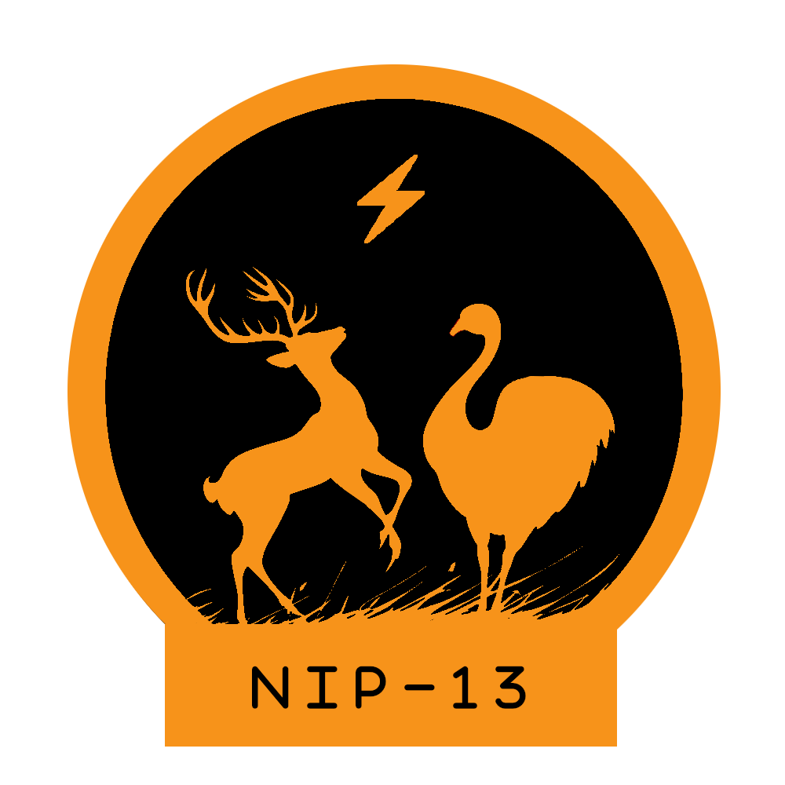
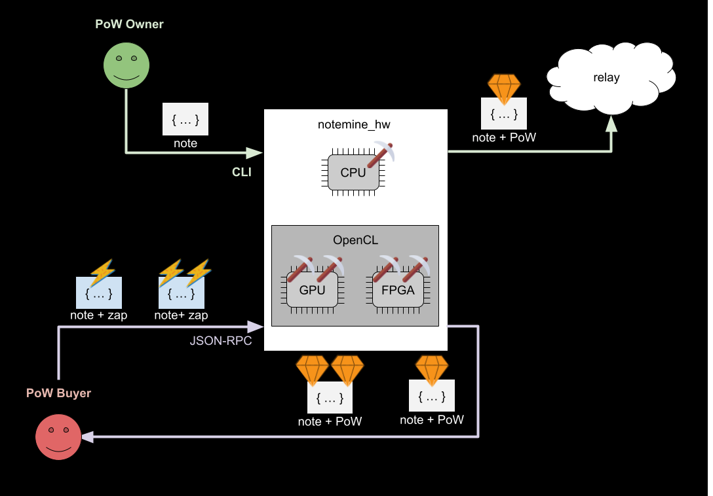
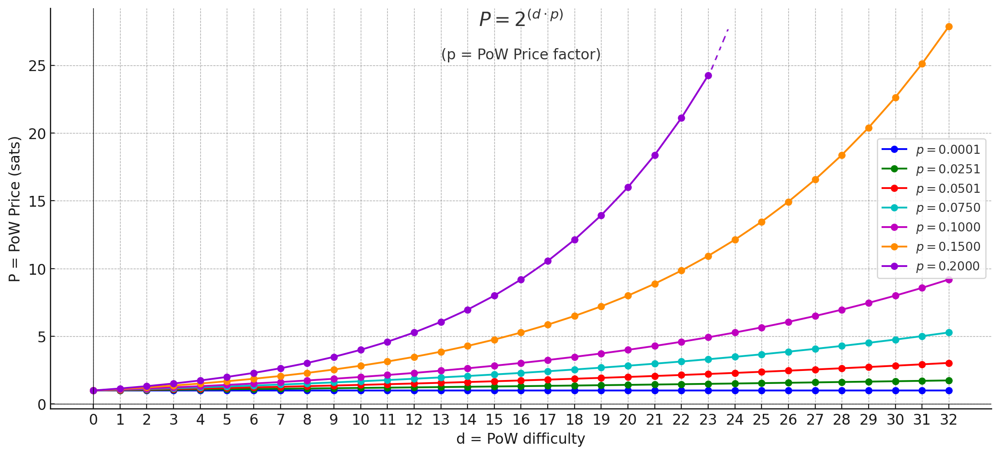

<h1 align="center">
  <br>
  
  <br>
🗒⛏ notemine_hw ⚡⚙️
<br>
</h1>

This is a fork of [`notemine`](https://github.com/sandwichfarm/notemine).

`notemine_hw` is a rust-based tool for mining [nostr](https://nostr.com) notes under [`NIP-13`](https://github.com/nostr-protocol/nips/blob/master/13.md).

While its parent project compiles to [WASM](https://webassembly.org/) and caters for a web-native experience,
`notemine_hw` aims to leverage hardware acceleration for mining notes.

## UI/UX

The UI/UX aims for:
- Configurable PoW difficulty.
- Multithreaded workers.
- Realtime hashrate logging.
- User can mine and publish their own notes, or sell PoW for zaps.

So `notemine_hw` can be used in two different ways:
- CLI (via `publish` subcommand)
- JSON-RPC (via `sell` subcommand)



### CLI

The CLI UI assumes that the user wants to mine and publish their own notes as JSON files from disk.

The `notemine_hw publish` subcommand is used for mining notes via CLI.

```shell
$ notemine_hw publish -h
Usage: notemine_hw publish --n-workers <N_WORKERS> --log-interval <LOG_INTERVAL> --difficulty <DIFFICULTY> --event-json <EVENT_JSON> --relay-url <RELAY_URL> --nsec <NSEC>

Options:
      --n-workers <N_WORKERS>        number of workers
      --log-workers                  log individual workers
  -l, --log-interval <LOG_INTERVAL>  log interval (secs)
  -d, --difficulty <DIFFICULTY>      difficulty
  -e, --event-json <EVENT_JSON>      path to event JSON file
  -r, --relay-url <RELAY_URL>        relay URL
      --nsec <NSEC>                  nsec
  -h, --help                         Print help

$ notemine_hw publish --n-workers 3 --log-workers --difficulty 22 --event-json event.json --relay-url 'wss://plebemineira.xyz' --nsec nsec13ezg388stxfnxe72nc20428r7lrxzst85d60vxynk6zr57lpxu6svjam98 --log-interval 1
2024-09-28T23:55:24.554771Z  INFO notemine_hw: 🗒⛏ notemine_hw ⚡⚙️
2024-09-28T23:55:24.559146Z  INFO notemine::service: starting miner service to mine and publish the JSON event
2024-09-28T23:55:24.561514Z  INFO notemine::miner: starting worker with parameters: worker id: 1 | difficulty: 22 | start_nonce: 6148914691236517205
2024-09-28T23:55:24.561526Z  INFO notemine::miner: starting worker with parameters: worker id: 0 | difficulty: 22 | start_nonce: 0
2024-09-28T23:55:24.561534Z  INFO notemine::miner: starting worker with parameters: worker id: 2 | difficulty: 22 | start_nonce: 12297829382473034410
2024-09-28T23:55:27.562271Z  INFO notemine::hashrate: reporting work... 
╭───────────┬────────────╮
│ worker id │  hashrate  │
├───────────┼────────────┤
│  global   │ 156642 h/s │
│     0     │ 51963 h/s  │
│     1     │ 52460 h/s  │
│     2     │ 52219 h/s  │
╰───────────┴────────────╯
2024-09-28T23:55:29.561855Z  INFO notemine::hashrate: reporting work... 
╭───────────┬────────────╮
│ worker id │  hashrate  │
├───────────┼────────────┤
│  global   │ 156675 h/s │
│     0     │ 52064 h/s  │
│     1     │ 52367 h/s  │
│     2     │ 52244 h/s  │
╰───────────┴────────────╯
2024-09-28T23:55:30.561859Z  INFO notemine::hashrate: reporting work... 
╭───────────┬────────────╮
│ worker id │  hashrate  │
├───────────┼────────────┤
│  global   │ 156535 h/s │
│     0     │ 51922 h/s  │
│     1     │ 52369 h/s  │
│     2     │ 52244 h/s  │
╰───────────┴────────────╯
2024-09-28T23:55:31.412536Z  INFO notemine::service: successfully mined event in 6.8533616 seconds
2024-09-28T23:55:31.412589Z  INFO notemine::service: MinedResult { event: PoWEvent { pubkey: "98590c0f4959a49f3524b7c009c190798935eeaa50b1232ba74195b419eaa2f2", kind: 1, content: "hello world", tags: [["nonce", "354170", "22"]], id: Some("000001365bf36b9b4617680af6a9ebf6a60b1e1e1d9a8ee71e60b2685b41522b"), created_at: Some(1727567724), sig: None }, total_time: 6.850695375 }
2024-09-28T23:55:31.416328Z  INFO nostr_sdk::client::handler: Spawned client notification handler
2024-09-28T23:55:31.417238Z  INFO notemine::client: connecting to relay: wss://plebemineira.xyz
2024-09-28T23:55:32.460250Z  INFO nostr_relay_pool::relay::internal: Connected to 'wss://plebemineira.xyz/'
2024-09-28T23:55:32.888720Z  INFO notemine::client: send mined event output: Output { val: EventId(000001365bf36b9b4617680af6a9ebf6a60b1e1e1d9a8ee71e60b2685b41522b), success: {Url { scheme: "wss", cannot_be_a_base: false, username: "", password: None, host: Some(Domain("plebemineira.xyz")), port: None, path: "/", query: None, fragment: None }}, failed: {} }
2024-09-28T23:55:32.889065Z  INFO notemine_hw: exiting...
```

The input JSON must contain the following fields:
- `pubkey`
- `kind`
- `tags`
- `content`

Optionally, the `created_at` field can also be provided. If not, the current UNIX timestamp is used.

for example:
```shell
$ cat event.json
{
  "pubkey": "98590c0f4959a49f3524b7c009c190798935eeaa50b1232ba74195b419eaa2f2",
  "created_at": 1668680774,
  "kind": 1,
  "tags": [],
  "content": "hello world",
}
```

### JSON-RPC

The JSON-RPC UI assumes the user wants to sell PoW for zaps.

PoW Price is calculated according to this formula:

$$ P = 2^{(d \cdot p)} $$

where:
- $P$: PoW Price [sats]
- $p$: PoW Price factor
- $d$: PoW difficulty



PoW sellers modulate their PoW Price factor $p$ in order to charge more or less sats according to PoW difficulty.

The `notemine_hw sell` subcommand is used to sell PoW.

```shell
$ notemine_hw sell -h
Usage: notemine_hw sell --n-workers <N_WORKERS> --log-interval <LOG_INTERVAL> --rpc-port <RPC_PORT> --pow-price-factor <POW_PRICE_FACTOR>

Options:
      --n-workers <N_WORKERS>                number of workers
      --log-workers                          log individual workers
  -l, --log-interval <LOG_INTERVAL>          log interval (secs)
  -r, --rpc-port <RPC_PORT>                  RPC port
  -p, --pow-price-factor <POW_PRICE_FACTOR>  PoW price factor
  -h, --help                                 Print help
```

A potential PoW buyer quotes the PoW price like this:
```shell 
$ curl -X POST -H "Content-Type: application/json" -d '{
   "jsonrpc": "2.0",
   "method": "quote",
   "params": {
      "difficulty": 20,
   },
   "id": 1
}' http://localhost:1337
{
  "jsonrpc": "2.0",
  "result": {
    "difficulty": 20,
    "pow-price": 1048576.0,
    "pow-price-factor": 1.0
  },
  "id": 1
}
```

In the example above, the buyer needs to zap `1048576.0` sats to mine a note with difficulty `20`, because `pow-price-factor` is set to `1.0`.

The PoW buyer sends a zap (along with the event to be mined) via JSON-RPC. If the zap contains enough sats, the response contains the mined event `id`:
```shell 
$ curl -X POST -H "Content-Type: application/json" -d '{
   "jsonrpc": "2.0",
   "method": "mine",
   "params": {
      "event": {
         "pubkey": "98590c0f4959a49f3524b7c009c190798935eeaa50b1232ba74195b419eaa2f2",
         "created_at": 1668680774,
         "kind": 1,
         "tags": [],
         "content": "hello world",
      },
      "difficulty": 20,
      "zap": "f481897ee877321783bb76133622b3cc344d691bb79cd6be88f44e819c3b2306"
   },
   "id": 1
}' http://localhost:1337
{
  "jsonrpc": "2.0",
  "result": {
    "id": "000006e73a6b1c2602fc41444c7c9fe382061a5e6616bf533379a043c8c77c75",
    "nonce": 7378697629483745322,
    "difficulty": 20
  },
  "id": 1
}
```

If the zap is invalid, `notemine_hw` replies with an error:
```shell
$ curl -X POST -H "Content-Type: application/json" -d '{
   "jsonrpc": "2.0",
   "method": "mine",
   "params": {
      "pubkey": "98590c0f4959a49f3524b7c009c190798935eeaa50b1232ba74195b419eaa2f2",
      "created_at": 1668680774,
      "kind": 1,
      "tags": [],
      "content": "hello world",
      "difficulty": 150,
      "zap": "nonsense"
   },
   "id": 1
}' http://localhost:1337
{
  "jsonrpc": "2.0",
  "error": {
    "code": -32602,
    "message": "Invalid Zap"
  },
  "id": 1
}
```

If the zap does not carry sufficient sats to cover for the PoW price of the requested difficulty, `notemine_hw` replies with an error.
```shell 
$ curl -X POST -H "Content-Type: application/json" -d '{
   "jsonrpc": "2.0",
   "method": "mine",
   "params": {
      "pubkey": "98590c0f4959a49f3524b7c009c190798935eeaa50b1232ba74195b419eaa2f2",
      "created_at": 1668680774,
      "kind": 1,
      "tags": [],
      "content": "hello world",
      "difficulty": 150,
      "zap": "f481897ee877321783bb76133622b3cc344d691bb79cd6be88f44e819c3b2306"
   },
   "id": 1
}' http://localhost:1337
{
  "jsonrpc": "2.0",
  "error": {
    "code": -32602,
    "message": "Insufficient Zap"
  },
  "id": 1
}
```

## platform support

- [ ] Linux GPU via [`opencl3`](https://crates.io/crates/opencl3) (TODO)

## dependencies

xxx todo instructions to install openCL xxx

## build

xxx todo build instructions with cargo feature flags xxx

## license
GNU General Public License v3.0
