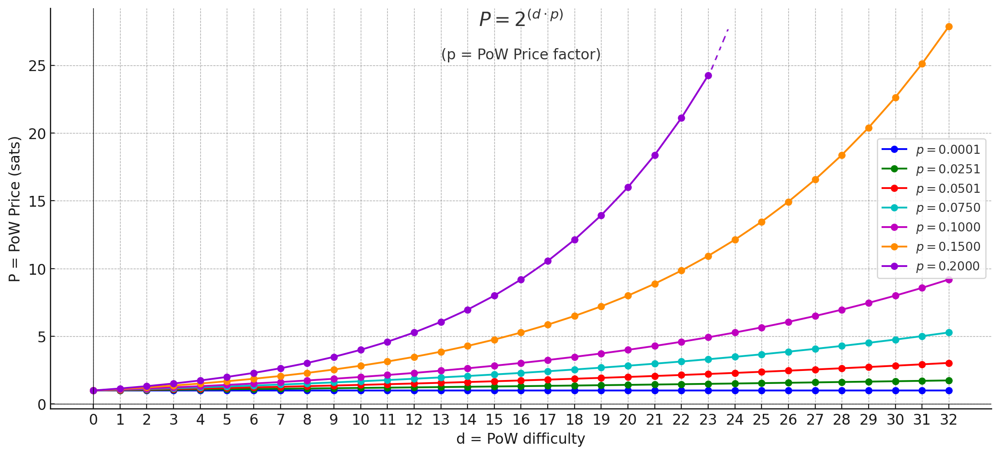

<h1 align="center">
  <br>
  
  <br>
🗒⛏ notemine_hw ⚡⚙️
<br>
</h1>

This is a fork of [`notemine`](https://github.com/sandwichfarm/notemine).

`notemine_hw` is a rust-based tool for mining [nostr](https://nostr.com) notes under [NIP13](https://github.com/nostr-protocol/nips/blob/master/13.md).

While its parent project compiles to [WASM](https://webassembly.org/) and caters for a web-native experience,
`notemine_hw` aims to leverage hardware acceleration for mining notes.

## UI/UX

The UI/UX aims for:
- Configurable PoW difficulty.
- Multithreaded workers.
- Realtime hashrate logging.
- User can mine and publish their own notes, or sell PoW for zaps.

So `notemine_hw` can be used in two different ways:
- CLI
- JSON-RPC

### CLI

The CLI UI assumes that the user wants to mine and publish their own notes as JSON files from disk.

The `notemine_hw mine` subcommand is used for mining notes via CLI.

```shell
$ notemine_hw mine -h
Usage: notemine_hw mine --n-workers <N_WORKERS> --difficulty <DIFFICULTY> --event-json <EVENT_JSON> --relay-url <RELAY_URL> --log-interval <LOG_INTERVAL> --nsec <NSEC>

Options:
      --n-workers <N_WORKERS>        number of workers
  -d, --difficulty <DIFFICULTY>      difficulty (the number of leading zero bits in the NIP-01 id)
  -e, --event-json <EVENT_JSON>      path to event JSON file
  -r, --relay-url <RELAY_URL>        relay URL
  -l, --log-interval <LOG_INTERVAL>  log interval (secs)
      --nsec <NSEC>                  nsec
  -h, --help                         Print help


$ notemine_hw --n-workers 7 -d 18 --event-json event.json -r ws://plebemineira.xyz:8080 --nsec nsec13ezg388stxfnxe72nc20428r7lrxzst85d60vxynk6zr57lpxu6svjam98 --log-interval 2
2024-09-20T03:00:01.780143Z  INFO notemine_hw: 🗒⛏ notemine_hw ⚡⚙️
2024-09-20T03:00:01.780510Z  INFO notemine::miner: starting worker with parameters: worker id: 0 | difficulty: 18 | start_nonce: 0 | nonce_step: 2635249153387078802
2024-09-20T03:00:01.780526Z  INFO notemine::miner: starting worker with parameters: worker id: 1 | difficulty: 18 | start_nonce: 1 | nonce_step: 2635249153387078802
2024-09-20T03:00:01.780564Z  INFO notemine::miner: starting worker with parameters: worker id: 2 | difficulty: 18 | start_nonce: 2 | nonce_step: 2635249153387078802
2024-09-20T03:00:01.780629Z  INFO notemine::miner: starting worker with parameters: worker id: 3 | difficulty: 18 | start_nonce: 3 | nonce_step: 2635249153387078802
2024-09-20T03:00:01.780639Z  INFO notemine::miner: starting worker with parameters: worker id: 4 | difficulty: 18 | start_nonce: 4 | nonce_step: 2635249153387078802
2024-09-20T03:00:01.780662Z  INFO notemine::miner: starting worker with parameters: worker id: 5 | difficulty: 18 | start_nonce: 5 | nonce_step: 2635249153387078802
2024-09-20T03:00:01.781942Z  INFO notemine::miner: starting worker with parameters: worker id: 6 | difficulty: 18 | start_nonce: 6 | nonce_step: 2635249153387078802
2024-09-20T03:00:03.780607Z  INFO notemine::miner: worker id: 0 | hashrate: 53457 h/s | best pow: 15 | best nonce: 13176245766935384394 | best hash: "0001d724579b85058862f118044637b7d740c69ac77294d7e4c15e85c29ebbea"
2024-09-20T03:00:03.780617Z  INFO notemine::miner: worker id: 1 | hashrate: 62991 h/s | best pow: 14 | best nonce: 5270498306774147101 | best hash: "00037233a6d87e65da3636109df00f062404a5a4b71416409b18399c4d8bd0b0"
2024-09-20T03:00:03.780645Z  INFO notemine::miner: worker id: 2 | hashrate: 53888 h/s | best pow: 15 | best nonce: 13176245766935384394 | best hash: "0001d724579b85058862f118044637b7d740c69ac77294d7e4c15e85c29ebbea"
2024-09-20T03:00:03.780705Z  INFO notemine::miner: worker id: 3 | hashrate: 54962 h/s | best pow: 14 | best nonce: 5270498306774147101 | best hash: "00037233a6d87e65da3636109df00f062404a5a4b71416409b18399c4d8bd0b0"
2024-09-20T03:00:03.780707Z  INFO notemine::miner: worker id: 4 | hashrate: 53887 h/s | best pow: 15 | best nonce: 13176245766935384394 | best hash: "0001d724579b85058862f118044637b7d740c69ac77294d7e4c15e85c29ebbea"
2024-09-20T03:00:03.780712Z  INFO notemine::miner: worker id: 5 | hashrate: 66345 h/s | best pow: 14 | best nonce: 5270498306774147101 | best hash: "00037233a6d87e65da3636109df00f062404a5a4b71416409b18399c4d8bd0b0"
2024-09-20T03:00:03.782005Z  INFO notemine::miner: worker id: 6 | hashrate: 53792 h/s | best pow: 15 | best nonce: 13176245766935384394 | best hash: "0001d724579b85058862f118044637b7d740c69ac77294d7e4c15e85c29ebbea"
2024-09-20T03:00:05.780634Z  INFO notemine::miner: worker id: 1 | hashrate: 53699 h/s | best pow: 15 | best nonce: 2635249153387059735 | best hash: "000105552d83dcfc1bb4f6449f54cd1cd8faea7bd1b5382fa4e48c2591308e74"
2024-09-20T03:00:05.780650Z  INFO notemine::miner: worker id: 2 | hashrate: 53232 h/s | best pow: 15 | best nonce: 13176245766935384394 | best hash: "0001d724579b85058862f118044637b7d740c69ac77294d7e4c15e85c29ebbea"
2024-09-20T03:00:05.780634Z  INFO notemine::miner: worker id: 0 | hashrate: 67169 h/s | best pow: 17 | best nonce: 15811494920322439638 | best hash: "0000662299d677b538288802d0707bfad2cd12007227bd0d53819ac3107e75a0"
2024-09-20T03:00:05.780725Z  INFO notemine::miner: worker id: 3 | hashrate: 64657 h/s | best pow: 15 | best nonce: 2635249153387059735 | best hash: "000105552d83dcfc1bb4f6449f54cd1cd8faea7bd1b5382fa4e48c2591308e74"
2024-09-20T03:00:05.780725Z  INFO notemine::miner: worker id: 5 | hashrate: 57281 h/s | best pow: 17 | best nonce: 18446744073709516953 | best hash: "00004337a7b72a077ebdc735fe21e664f2518d7e86970379f6ad6d61720d0b5b"
2024-09-20T03:00:05.780733Z  INFO notemine::miner: worker id: 4 | hashrate: 53695 h/s | best pow: 15 | best nonce: 13176245766935384394 | best hash: "0001d724579b85058862f118044637b7d740c69ac77294d7e4c15e85c29ebbea"
2024-09-20T03:00:05.782003Z  INFO notemine::miner: worker id: 6 | hashrate: 58479 h/s | best pow: 15 | best nonce: 13176245766935384394 | best hash: "0001d724579b85058862f118044637b7d740c69ac77294d7e4c15e85c29ebbea"
2024-09-20T03:00:07.714490Z  INFO notemine_hw: successfully mined event in 5.934721 seconds
2024-09-20T03:00:07.714526Z  INFO notemine_hw: MinedResult { event: NostrEvent { pubkey: "79dff8f82963424e0bb02708a22e44b4980893e3a4be0fa3cb60a43b946764e3", kind: 1, content: "hello world", tags: [["nonce", "15811494920322422749", "18"]], id: Some("00003b51118581384f573b4939556dcd2743e02977bba1e73214ffc02d573304"), created_at: Some(1668680774), sig: "4be1dccd81428990ba56515f2e9fc2ae61c9abc61dc3d977235fd8767f52010e44d36d3c8da30755b6440ccaf888442f7cbbd7a17e34ca3ed31c5e8a33a7df11" }, total_time: 5.933679131 }
2024-09-20T03:00:07.718901Z  INFO notemine::client: connecting to relay: ws://plebemineira.xyz:8080
2024-09-20T03:00:07.719180Z  INFO nostr_sdk::client::handler: Spawned client notification handler
2024-09-20T03:00:07.719210Z  INFO nostr_relay_pool::relay::internal: 1 messages queued for ws://plebemineira.xyz:8080/ (capacity: 1023)
2024-09-20T03:00:08.269040Z  INFO nostr_relay_pool::relay::internal: Connected to 'ws://plebemineira.xyz:8080/'
2024-09-20T03:00:08.529793Z  INFO notemine::client: send mined event output: Output { val: EventId(00003b51118581384f573b4939556dcd2743e02977bba1e73214ffc02d573304), success: {Url { scheme: "ws", cannot_be_a_base: false, username: "", password: None, host: Some(Domain("plebemineira.xyz")), port: Some(8080), path: "/", query: None, fragment: None }}, failed: {} }
2024-09-20T03:00:08.529897Z  INFO notemine_hw: exiting...
```

The input JSON must contain the following fields:
- `pubkey`
- `crated_at`
- `kind`
- `tags`
- `content`

for example:
```shell
$ cat event.json
{
  "pubkey": "98590c0f4959a49f3524b7c009c190798935eeaa50b1232ba74195b419eaa2f2",
  "created_at": 1668680774,
  "kind": 1,
  "tags": [],
  "content": "hello world",
}
```

### JSON-RPC

The JSON-RPC UI assumes the user wants to sell PoW for zaps.

PoW Price is calculated according to this formula:

$$ P = 2^{(d \cdot p)} $$

where:
- $P$: PoW Price [sats]
- $p$: PoW Price factor
- $d$: PoW difficulty



PoW sellers modulate their PoW Price factor $p$ in order to charge more or less sats according to PoW difficulty.

The `notemine_hw sell` subcommand is used to sell PoW.

```shell
$ notemine_hw sell -h
Usage: notemine_hw sell --n-workers <N_WORKERS> --log-interval <LOG_INTERVAL> --rpc-port <RPC_PORT> --pow-price-factor <POW_PRICE_FACTOR>

Options:
      --n-workers <N_WORKERS>                number of workers
  -l, --log-interval <LOG_INTERVAL>          log interval (secs)
  -r, --rpc-port <RPC_PORT>                  RPC port
  -p, --pow-price-factor <POW_PRICE_FACTOR>  PoW price factor
  -h, --help                                 Print help
```

A potential PoW buyer quotes the PoW price like this:
```shell 
$ curl -X POST -H "Content-Type: application/json" -d '{
   "jsonrpc": "2.0",
   "method": "quote",
   "params": {
      "difficulty": 20,
   },
   "id": 1
}' http://localhost:1337
{
  "jsonrpc": "2.0",
  "result": {
    "difficulty": 20,
    "pow-price": 1048576.0,
    "pow-price-factor": 1.0
  },
  "id": 1
}
```

In the example above, the buyer needs to zap `100` sats to mine a note with difficulty `15`.

The PoW buyer sends a zap (along with the event to be mined) via JSON-RPC. If the zap contains enough sats, the response contains the mined event `id`:
```shell 
$ curl -X POST -H "Content-Type: application/json" -d '{
   "jsonrpc": "2.0",
   "method": "mine",
   "params": {
      "event": {
         "pubkey": "98590c0f4959a49f3524b7c009c190798935eeaa50b1232ba74195b419eaa2f2",
         "created_at": 1668680774,
         "kind": 1,
         "tags": [],
         "content": "hello world",
      },
      "difficulty": 15,
      "zap": "f481897ee877321783bb76133622b3cc344d691bb79cd6be88f44e819c3b2306"
   },
   "id": 1
}' http://localhost:1337
{
    "error": null,
    "id": 1,
    "result": [
        [
            "id": "0001db1f0f6951f2938ecbd0712bbed5dee721daf3b36f4d35309828a309eeee",
            "nonce": "18446744073709546934",
            "difficulty": "15"
        ]
    ]
}
```

If the zap does not carry sufficient sats, `notemine_hw` replies with an error, and the buyer lost their funds forever:
```shell 
$ curl -X POST -H "Content-Type: application/json" -d '{
   "jsonrpc": "2.0",
   "method": "mine",
   "params": {
      "pubkey": "98590c0f4959a49f3524b7c009c190798935eeaa50b1232ba74195b419eaa2f2",
      "created_at": 1668680774,
      "kind": 1,
      "tags": [],
      "content": "hello world",
      "difficulty": 150,
      "zap": "f481897ee877321783bb76133622b3cc344d691bb79cd6be88f44e819c3b2306"
   },
   "id": 1
}' http://localhost:1337
{
   "jsonrpc":"2.0",
   "error":{
      "code":-1,
      "message":"insufficient zap"
   }
}
```

## platform support

- [ ] Linux GPU via [`opencl3`](https://crates.io/crates/opencl3) (TODO)

## dependencies

xxx todo instructions to install openCL xxx

## build

xxx todo build instructions with cargo feature flags xxx

## license
GNU General Public License v3.0
